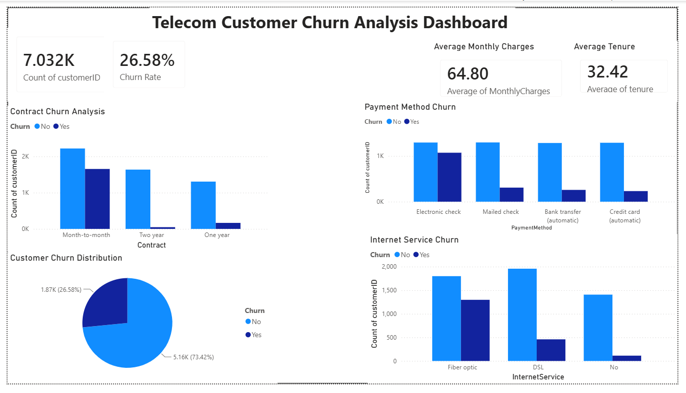
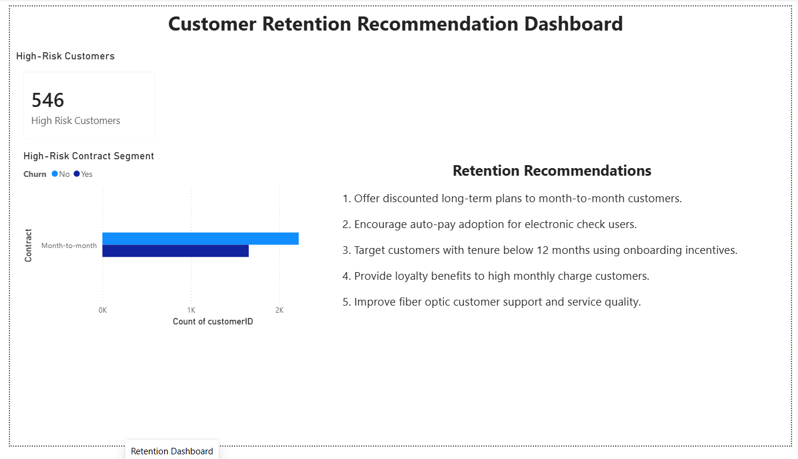

# Telecom Customer Churn Analysis

## Project Overview

This project analyzes telecom customer churn behavior using Python, SQL, and Power BI to identify customer loss patterns and recommend retention strategies.

## Problem Statement

Telecom companies lose customers due to pricing, contract types, payment methods, and service dissatisfaction. This project aims to:

* Identify why customers churn
* Analyze high-risk customer segments
* Provide business recommendations to improve retention

## Tech Stack

* **Python** (Pandas, NumPy, Matplotlib)
* **SQL** (SQLite)
* **Power BI**
* **Git & GitHub**

## Project Workflow

1. Data Cleaning & Preprocessing
2. Exploratory Data Analysis (EDA)
3. SQL Business Analysis
4. Power BI Dashboard Development
5. Customer Retention Recommendation Analysis

## Key Insights

* Month-to-month customers show the highest churn.
* Electronic check users have higher churn rates.
* Fiber optic customers exhibit increased churn risk.
* Customers with lower tenure are more likely to churn.
* 2-year contracts demonstrate strongest customer retention.
* Identified **546 high-risk customers** likely to churn.

## Dashboard Features

### Executive Dashboard

* Churn rate KPI
* Contract type churn analysis
* Payment method churn analysis
* Internet service churn trends
* Customer churn distribution

### Retention Dashboard

* High-risk customer segmentation
* Customer retention recommendations
* Business-focused action plan

## Dashboard Preview

### Executive Dashboard

### Retention Dashboard

## Dataset

IBM Telco Customer Churn Dataset (Kaggle)

## Author

**Harbin KS**

